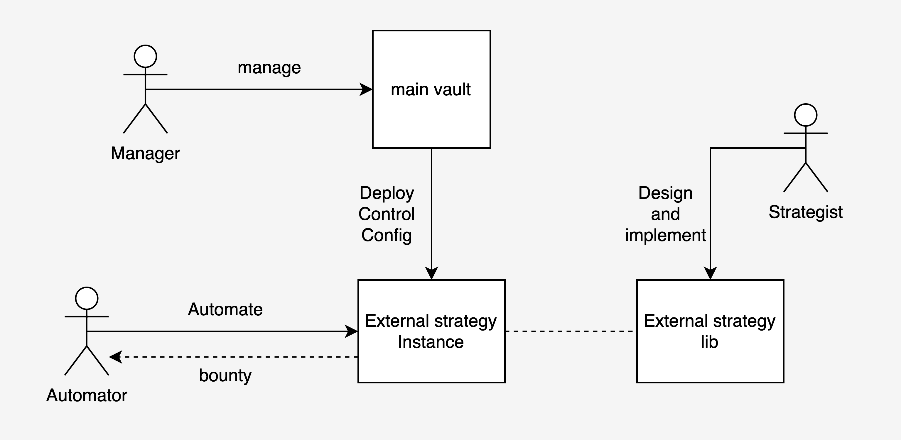

## External strategy (request for comment)

### Abstract
Enzyme creates a strong foundation for a wide range of fund managers to build upon, but with the diversity of managers ranged from a sophisticated fund running proprietary system to small team, lone managers, and even protocol/DAO/Multi-sig. There's a clear gap in the ability to run a fund efficiently. A system can run 24/7 and easily construct series of transaction to accomplish complex strategy in near real time. Meanwhile, protocols or DAOs that rely on smart contract integration or multi-sig would have a significant limitation to their ability to monitor or transact on such fund.

With the sulu release, one promising feature is external position which allows a fund manager to take a more complex position like debt or univ3 LP.

However, there's potential to offer even more. The external position mechanism also allows for fund management though smart contracts. With that we aim to create a family of external positions that enable fund manager to execute a complex strategy and/or automate a task (e.g. auto compound) with ease while maintaining custody of their assets. 

### Motivation
Enzyme has a large collection of integrations. However, all of these integrations are low level. In most case, a complex strategy would require a series of well executed transactions. This is at best discouraging for managers without the infrastructure to automate, or at worse, impractical for a user who runs on a prohibitive interface, ie. a multi-sig wallet. Not to mention a risk of human error. 

There are protential improvements for a more actively managed/maintained fund. e.g. regularly compounded rewards.

### Proposed solution
We propose external strategies, a family of external positions that allow fund managers to execute predefined strategy with ease. While also provide options to automate tasks, react to risk, or signals from 3rd party providers.

Each external strategy will be a smart contract. Implemented strategy will share an intuitive interface. Exponent team will also provide the means to support manager to deploy, config, maintain, unwind individual strategy.

The automation can be done by any account which allows for more flexibility. For example, a multi-sig can deploy a strategy, but use another EOA to maintain the position, thus bypassing the cumbersome multi-sig signing workflow. Managers can set up bounties that invite MEV searcher to help with the task, or work with any technology provider, such as the Exponent team, to facilitate strategy automation.

### Technical specification
Apart from implementing the IExternalPosition interface, each External strategy will also inherit from [ExternalStrategyBase](https://github.com/exponent-cx/external-strategy/blob/main/contracts/ExternalStrategy/ExternalStrategyBase.sol). 

List of action that a vault can execute via receiveCallFromVault:
 
- Enter: allows fund manager to deploy fund and execute the strategy
- Reduce: allows fund manager to unwind strategy.
- Withdraw: allows fund manager to return assets back to the main fund.

- Config (optional): allows fund manager to change parameter for a strategy. Note that configurable parameter will be different for each contract and some strategy might not require any configuration. 
- AdminExecute (optional): for some strategy that might allow fund manager to do others action. 

- Automate (optional): Automate allows 3rd party to automate tasks based on behalf of fund manager. This function allow anyone to call and takes 0 argument. and will execute based on manager's config and predefined strategy. Some strategy might also allow manager to set a bounty for the caller.

Parsing with [UniversalParser](https://github.com/exponent-cx/external-strategy/blob/main/contracts/ExternalStrategy/UniversalParser.sol)
all external strategy can use the same universalExternalStrategyParser which will forward the call to each external strategy contract.

each externalStrategy will implement parseEnter, parseReduce, and parseAdminExecute that parse corresponding action data. others action already implemented in the universalParser.

the contract can be found [here](https://polygonscan.com/address/0x1b8f25c3e1abcf8d89fa25ac2ff817af6120631e)

### AMM LP Auto Compound Strategy
the first external strategy we provide is auto compound on Sushiswap LP Staking

behavior:
- `enter(address, amount)` - sell the asset into 2 parts. provide liquidity and stake on sushi
- `reduce(amount)` - unstake, remove lp based on amount. 
- `automate()` - harvest reward. sell asset in auto-sell list, provide LP, and stake. (optional) pay bounty to caller.

configuable param:
- address token1, token2 - address of ERC20 pair to farm
- uint poolID - tool to stake on
- address[] autoSellList - list of ERC20 to automatically sell on automate 
- uint bounty - bonus to automate() caller as % of compounded amount (in bip)
- bool allowAutomate - allow automate

the contract can be found [here](https://polygonscan.com/address/0x332a93f042a6359639dc24c77409672e22997ac8)

